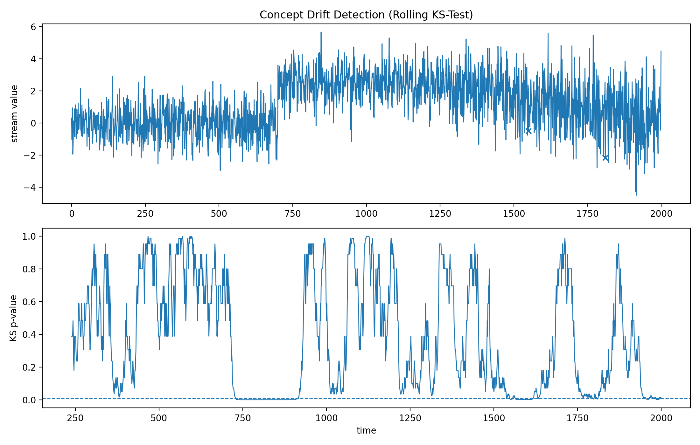

# Concept Drift Detection (Rolling KS-Test)

Concept drift occurs when the data distribution changes over time, leading to model performance degradation in deployed machine learning systems.

This repository implements a minimal, research-oriented **rolling-window drift detector** based on the **two-sample Kolmogorov–Smirnov (KS) test**, and demonstrates its behavior on synthetic streaming data with clear visualizations.

---

## Method: Rolling KS Window

We maintain two sliding windows over a univariate data stream:

- **Reference window A** — older observations  
- **Current window B** — newer observations  

At each time step (once both windows are full), we compute a two-sample KS test between A and B.

A drift alert is triggered when:

> `p-value < alpha`  
> for `n_consecutive` checks.

This approach is:

- Nonparametric  
- Interpretable  
- Sensitive to distributional changes (mean, variance, shape)  
- Easy to extend to multivariate settings  

---

## Quickstart

```bash
pip install -e .
python examples/synthetic_shift.py
```
Output figure is saved to:

`figures/drift_demo.png`

## Project Structure

```text
src/
  stream.py                  # synthetic streaming generator
  detectors/
    ks_window.py             # rolling KS detector
  visualize.py               # plotting utilities

examples/
  synthetic_shift.py         # demo script

tests/
  test_ks_detector.py        # basic correctness tests

figures/
  drift_demo.png             # generated output
```
That will render correctly on GitHub.

## Output

Below is an example drift detection run on synthetic data with:
- stable distribution
- sudden mean shift
- gradual variance drift



## Notes & Extensions

- This implementation targets **univariate streams**.  
  For multivariate drift detection, per-feature tests can be applied and their outputs aggregated (e.g., voting, max statistic, or combined significance testing).

- The KS test is **distribution-free** and sensitive to general distributional changes, including shifts in mean, variance, and shape.

- The rolling-window design assumes a fixed reference window. In practice, more advanced approaches may:
  - Use adaptive or expanding reference windows  
  - Incorporate weighted or forgetting mechanisms  
  - Adjust significance thresholds dynamically  

- The current detector emits discrete alerts. In real deployment settings, alert smoothing, cooldown periods, or severity scoring may be desirable to avoid repeated alerts during prolonged drift episodes.

- This implementation is intended as an interpretable baseline for studying streaming distribution shift and can be extended with alternative statistical tests (e.g., Cramér–von Mises, Anderson–Darling) or online drift detectors (e.g., ADWIN).
## Research Context

- Concept drift detection is critical in real-world ML systems where data evolves over time (e.g., cybersecurity, fraud detection, online monitoring).
- This repository provides a controlled and interpretable baseline for studying distributional shift in streaming environments.
---

